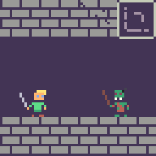

<a name="readme-top"></a>

<!-- PROJECT SHIELDS -->

[![MIT License][license-shield]][license-url]

<!-- PROJECT LOGO -->
<br />
<div align="center">
  <a href="https://github.com/kidthales/dd-framework">
    
  </a>

  <h3 align="center">Dank Developer Framework</h3>

  <p align="center">
    Enhance your next Pixel Game Maker MV project with extendable plugin & scripting support.
    <br />
    <a href="https://github.com/kidthales/dd-framework"><strong>Explore the docs »</strong></a>
    <br />
    <br />
    <a href="https://github.com/kidthales/dd-framework">View Demo</a>
    ·
    <a href="https://github.com/kidthales/dd-framework/issues">Report Bug</a>
    ·
    <a href="https://github.com/kidthales/dd-framework/issues">Request Feature</a>
  </p>
</div>

<!-- TABLE OF CONTENTS -->
<details>
  <summary>Table of Contents</summary>
  <ol>
    <li>
      <a href="#about-the-project">About The Project</a>
      <ul>
        <li><a href="#built-with">Built With</a></li>
      </ul>
    </li>
    <li>
      <a href="#getting-started">Getting Started</a>
      <ul>
        <li><a href="#prerequisites">Prerequisites</a></li>
        <li><a href="#installation">Installation</a></li>
      </ul>
    </li>
    <li><a href="#usage">Usage</a></li>
    <li><a href="#roadmap">Roadmap</a></li>
    <li><a href="#contributing">Contributing</a></li>
    <li><a href="#license">License</a></li>
    <li><a href="#contact">Contact</a></li>
    <li><a href="#acknowledgments">Acknowledgments</a></li>
  </ol>
</details>

<!-- ABOUT THE PROJECT -->

## About The Project

![Dank Developer Framework][product-screenshot]

Pixel Game Maker MV (PGMMV) is a great 'no-code' tool for making 2d games. The ability to extend the tool with scripting & plugins is a powerful feature; however, it is challenging to manage & reuse code for larger scripts & plugins. This framework is a distillation of my PGM scripting journey; lessons learned from many experiments, prototypes, and debugging sessions.

Some guiding principles:

-   **Writing a plugin for PGM should be fun.**
    -   VSCode Intellisense support for the PGM script API & and a large part of the Cocos2d-x JS API.
    -   Use common conventions for structuring a plugin & keeping it maintainable as more features are added.
    -   Provide a common code base for making the 'boilerplate' tasks of creating a plugin smoother & more automated.
-   **Don't Repeat Yourself (DRY).**
    -   Action commands & link conditions use a common API, allowing custom scripts to access the same logic, directly.
    -   Plugins expose a common API for other plugins to consume.
    -   We make use of a code bundler, allowing us to compose our plugins & APIs from multiple files.

<p align="right">(<a href="#readme-top">back to top</a>)</p>

### Built With

-   [![Webpack][Webpack.js]][Webpack-url]
-   [![Babel][Babel.js]][Babel-url]

<p align="right">(<a href="#readme-top">back to top</a>)</p>

<!-- GETTING STARTED -->

## Getting Started

To get a local copy up and running follow these simple example steps.

### Prerequisites

1.  Ensure [Node.js](https://nodejs.org/en/download) is installed.
2.  Any IDE you are comfortable with. This project comes with some [sample settings](./.vscode/sample.settings.json) for use with [VSCode](https://code.visualstudio.com/download).

### Installation

1.  [Download](https://github.com/kidthales/dd-framework/archive/refs/heads/main.zip) the Dank Developer framework and extract the folder to your workspace.
2.  We should now have a directory structure similar to:
    ```
    my-workspace/
     └──dd-framework-main/  * dank developer framework
    ```
    Open a shell and navigate to our framework directory & install dependencies:
    ```
    cd path/to/my-workspace/dd-framework-main && npm install
    ```

<p align="right">(<a href="#readme-top">back to top</a>)</p>

<!-- USAGE EXAMPLES -->

## Usage

TODO

### Build

Bundle the framework plugins into single files & output to `dist/`:

```
npm run build
```

The output files can then be imported into the PGMMV editor.

<p align="right">(<a href="#readme-top">back to top</a>)</p>

<!-- ROADMAP -->

## Roadmap

-   [ ] GitHub Workflows, Releases ~~Add Changelog~~
-   [ ] Add Documentation
    -   [x] Getting Started
    -   [ ] Usage
    -   [ ] Scripting API
    -   [ ] Custom Scripting Example
    -   [ ] Custom Plugin Example
    -   [ ] FAQ
-   [ ] Port Plugins From https://github.com/kidthales/pgmmv-support
    -   [x] Global Variable (as [DD Framework - Data Plugin](./src/plugins/data/))
    -   [ ] Linear Movement
    -   [ ] Object Filter
    -   [ ] Scene Effect
    -   [ ] Static Storage
-   [ ] Message Plugin
-   [ ] Multi-language Support

See the [open issues](https://github.com/kidthales/dd-framework/issues) for a full list of proposed features (and known issues).

<p align="right">(<a href="#readme-top">back to top</a>)</p>

<!-- CONTRIBUTING -->

## Contributing

Any contributions you make are **greatly appreciated**.

If you have a suggestion that would make this better, please fork the repo and create a pull request. You can also simply open an issue with the tag "enhancement".
Don't forget to give the project a star! Thanks again!

1. Fork the Project
2. Create your Feature Branch (`git checkout -b feature/AmazingFeature`)
3. Commit your Changes (`git commit -m 'Add some AmazingFeature'`)
4. Push to the Branch (`git push origin feature/AmazingFeature`)
5. Open a Pull Request

<p align="right">(<a href="#readme-top">back to top</a>)</p>

<!-- LICENSE -->

## License

Distributed under the MIT License. See `LICENSE.txt` for more information.

<p align="right">(<a href="#readme-top">back to top</a>)</p>

<!-- CONTACT -->

## Contact

kidthales - kidthales@agogpixel.com

Project Link: [https://github.com/kidthales/dd-framework](https://github.com/kidthales/dd-framework)

<p align="right">(<a href="#readme-top">back to top</a>)</p>

<!-- ACKNOWLEDGMENTS -->

## Acknowledgments

-   [Baz Support](https://www.patreon.com/bazsupport)
-   [README Template](https://github.com/othneildrew/Best-README-Template)

<p align="right">(<a href="#readme-top">back to top</a>)</p>

<!-- MARKDOWN LINKS & IMAGES -->
<!-- https://www.markdownguide.org/basic-syntax/#reference-style-links -->

[license-shield]: https://img.shields.io/github/license/othneildrew/Best-README-Template.svg?style=for-the-badge
[license-url]: https://github.com/kidthales/dd-framework/blob/master/LICENSE.txt
[product-screenshot]: assets/img/screenshot.png
[Babel.js]: https://img.shields.io/badge/babel-323330?style=for-the-badge&logo=babel&logoColor=f5da55
[Babel-url]: https://babeljs.io/
[Webpack.js]: https://img.shields.io/badge/webpack-444950?style=for-the-badge&logo=webpack&logoColor=5468ff
[Webpack-url]: https://webpack.js.org/
